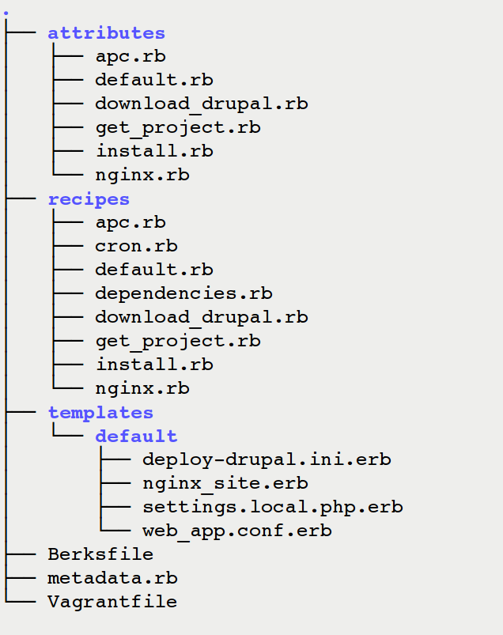

<h2 style="margin:100px auto;font-size:2.2em; font-weight:bold;">
  Cooking Drupal with Chef
</h2>

  
  <code style="float:right; font-size:0.7em;">
    
Amir Kadivar 

    
 amir@evolvingweb.ca 

    
 github.com/amirkdv 

  </code>

--end--

## Outline

* Automated Infrastructure: Problem Definition 
* Virtualization
* Configuration Management
* Chef
* Chef for Drupal

--end--

## Problem Definition

### development environments
* consistency (with production and other devs)
* choice of tools (limiting developers)
* multiple platforms

### testing and integration
* is every commit tested?
* test environment (testing a web application leaves a lot of cruft)

### deployment
* how do you go from zero to live site?
* how frequent are changes pushed to production?

--end--

## Enters Virtualization

* processes sharing hardware → O/S s sharing hardware
* A VM is an _environment_ that a VM Monitor creates
* These _environments_ should, ideally, be:
  * isolated from each other
  * equivalent to a real machine
  * as efficient as a real machine
* We have achieved all of these!
--end--

## Virtualization Technologies

* Types of VM Monitors
* Methods of Virtualization
* why is  relevant?

--end---

## How does Virtualization Help?

<!-- * VMs are cheap to build and to throw away! -->

### development:
* VM for every project
* VM for each developer

### testing & integration:
* spin up throwaway VM for tests, as frequently as you wish

### deployment:
* crufty prod? start from fresh VM
* switch platform? start from fresh VM

--end--

## Missing Piece: Provisioning

### VMs are cheap but:
* how much work is it to configure a VM from _scratch_?
* 

  how much of this work is reusable for a similar
  _but not identical_ use case?

* 

  how do you maintain _consistent_ configuration
  accross different machines?
  

--end--

## Config Management tools

* Config described in a programming (instead of human) language:
  * version control
  * reusable
* High level programming language instead of shell scripts
  * cross-platform configuration
  * more readable/maintainable

--end--

###  
* What is it exactly?
* Concepts:
  * State
  * Resources
  * Idempotence
--end--

## How does  work?
* Recipes and Cookbooks
* Run Lists
* Attributes
* Assets: Files and Templates
* Nodes and C/S Chef
---end---

## Ruby

    #ruby
    # a function
    def double (x)
      return 2*x
    end 
    
    puts double 12 # => 24
    
--end----
## Ruby 
    #ruby 
    if File.exists? '/foo/bar.php'
      puts "found it"
    end
     
    puts "found it" if File.exists? 'foo'

---end---
## Ruby
    #ruby
    ['John','Mary', 'Bob'].each do |guest|
      puts 'Pleased to meet you #{guest}!'
    end
----end---

## Resources
    
    #ruby
    directory "/path/to/some/directory" do
      owner "user1"
      group "group1"
    end
----end---

## Resources

    #ruby
    execute "some-task" do
      cwd "/path/to/some/directory"
      command "command --with-some options"
      creates "/path/to/some/file"
    end
---end---
## an idempotent resource
    #ruby
    execute "my-important-file" do
      command "cp -Rf /vagrant/. #{node['drupal-camp']['the-directory']}/"
      creates node['drupal-camp']['the-directory'] + "/foo.txt"
    end

---end---
## Attributes
* key value pairs: `"mysql_root_password" => "secret"`
* values can be hashes themselves: `node['drupal']['version']`
* values can be arrays: ` ["80" , "8000"]`
* who sets a node's attributes for a Chef run?
  * attribute files
  * run-time specified json file
  * roles & environments
* precedence levels
---end---

### a simple template

    #ruby
    # in some recipe:
    template "/usr/local/bin/foo.sh" do
      source "my_template.sh.erb"
      mode 0755
      owner "root"
      group "root"
      variables({
        'user' => 'www-data',
        'group'=> 'sysadmin'
      })
    end
    
--end---
### a simple template
    
    #bash
    # /usr/local/bin/foo.sh 

    #! /bin/bash
    # script generated by Chef
    chown www-data:sysadmin /var/www

    #bash
    # templates/default/my_template.sh.erb
    #! /bin/bash
    # script generated by Chef
    chown <%= @user %>:<%= @group %> /var/www
--end--

  
  
--end--
### Platform configuration
* HTTP Server
* Database
* PHP
* APC, memcached, Search, Reverse Proxy, Firewall, ...

### Drupal configuration
* download Drupal/codebase
* prepare database
* run the installation script _or_ populate the database
* setup cron
* manage modules
--end---
## Our Drupal cookbooks
### deploy-drupal
[github.com/evolvingweb/chef-deploy-drupal](http://github.com/evolvingweb/chef-deploy-drupal)
### drupal-solr
[github.com/evolvingweb/chef-drupal-solr](http://github.com/evolvingweb/chef-drupal-solr)

--end---
## Cookbook Structure

--end----
## `metadata.rb`
    #ruby    
    name    "deploy-drupal"
    # [maintainer and license info]
    depends "apt"
    depends "build-essential"
    depends "git"
    depends "curl"
    depends "apache2"
    depends "php"
    depends "memcached"
    depends "drush"
    depends "mysql"
    depends "xhprof"
    depends "nginx"
--end--
##`recipes/default.rb`
    #ruby
    ## Cookbook Name:: deploy-drupal
    ## Recipe:: default
    
    include_recipe 'deploy-drupal::dependencies'
    include_recipe 'deploy-drupal::apc'
    include_recipe 'deploy-drupal::download_drupal'
    include_recipe 'deploy-drupal::get_project'
    include_recipe 'deploy-drupal::install' 
--end--
### Some Attributes
    #ruby
    default['deploy-drupal']['get_project']['git_repo'] = 'git://server:repo.git'
    default['deploy-drupal']['get_project']['git_branch'] = 'master'
    
    # user group owning drupal codebase files
    default['deploy-drupal']['dev_group'] = 'root'
    
    default['deploy-drupal']['project_name'] = 'cooked.drupal'  
    
    # absolute path to project directory
    default['deploy-drupal']['project_root'] = 
      "/var/shared/sites/#{node['deploy-drupal']['project_name']}"
    
    default['deploy-drupal']['drupal_root'] = "#{node['deploy-drupal']['project_root']}/site"
--end--
### `recipes/get_project.rb`
    #ruby
    # creates /var/shared/sites/cooked.drupal
    directory node['deploy-drupal']['project_root'] do
      group node['deploy-drupal']['dev_group']
      recursive true
    end

    project = node['deploy-drupal']['project_root']
    url = node['deploy-drupal']['get_project']['git_repo']
    branch  = node['deploy-drupal']['get_project']['git_branch']
    
    gitclone = "git clone #{url} #{project}" 
      # git clone git://server:repo.git cooked.drupal 
    gitcheckout = "cd #{project}; git checkout #{branch}"
      # cd cooked.drupal; git checkout master
    
    # clone git repo and checkout branch
    execute "get-project-from-git" do
      command "#{gitclone}; #{gitcheckout}"
      group node['deploy-drupal']['dev_goup']
      creates node['deploy-drupal']['drupal_root'] + "/index.php"
      not_if { node['deploy-drupal']['get_project']['git_repo'].empty? }
      notifies :restart, "service[apache2]"
    end

--end--
## Attributes

--end--
## Attributes

Attributes tell you a lot about what a cookbook does!
    
    #ruby
    # attributes/install.rb
    #
    # MySQL credentials
    default['deploy-drupal']['install']['db_user'] = 'drupal_user'
    default['deploy-drupal']['install']['db_pass'] = 'drupal_pass'
    default['deploy-drupal']['install']['db_name'] = 'drupal_db'

    # Drupal user one
    default['deploy-drupal']['install']['admin_user'] = 'admin'
    default['deploy-drupal']['install']['admin_pass'] = 'admin_pass'

    # path to sql dump file (can be .sql.gz) to populate the database
    # can be absolute or relative to project root
    default['deploy-drupal']['install']['sql_dump'] = ''
    # path to bash script file to be executed after installation
    # can be absolute or relative to project root
    default['deploy-drupal']['install']['script'] = ''
--end--
### Who uses all these attributes?
    #ruby
    #recipes/install.rb
    mysql_connection = "mysql --user='root' --host='localhost' \
                              --password='#{node['mysql']['server_root_password']}'"
    db_user = "'#{node['deploy-drupal']['install']['db_user']}'@'localhost'"
    db_pass = node['deploy-drupal']['install']['db_pass']
    db_name = node['deploy-drupal']['install']['db_name']
    grant_sql = "GRANT ALL ON #{db_name}.* TO #{db_user} IDENTIFIED BY '#{db_pass}';"
    # GRANT ALL ON drupal.* to 'drupal_user'@'localhost' IDENTIFIED BY 'db_pass';

    bash "prepare-mysql" do
      code <<-EOH
        #{mysql_connection} -e "#{grant_sql}; FLUSH PRIVILEGES;"
        #{mysql_connection} -e "CREATE DATABASE IF NOT EXISTS #{db_name};"
      EOH 
    end
    # mysql --user='root' --host='localhost' --password='root' -e "GRANT ALL ON  ..."
--end--
### What has been automated?
* Zero to Live: Drupal 6 _and_ 7
* Code Source can be: 
  * drupal.org _or_ git repo _or_ filesystem
* Database can be populated from: 
  * database dump _or_ install schema via drush
* Solr search integration:
  * Install Tomcat and Solr,
  * Install Drupal Solr search module,
  * Index Drupal data
* Production Site considerations:
  * Firewall configuration
  * Nginx Reverse proxy
  * Add custom post-provisioning script
--end--
## Review
* Infrastructure Automation
* Virtualization Technologies and Vagrant
* Chef and how it works
* Deploying Drupal with Chef
--end---
# Questions?
